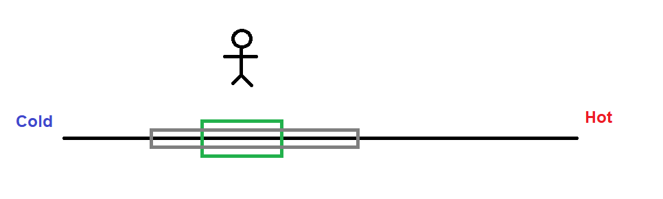
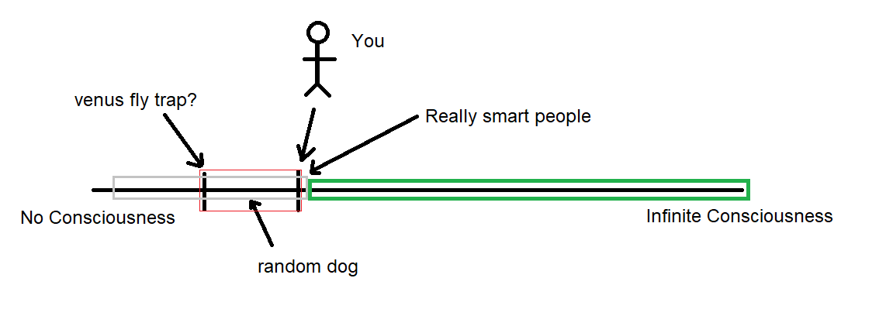
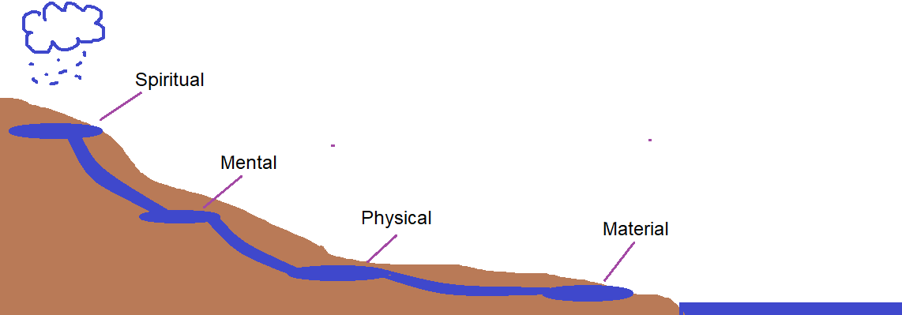

These revelations are the connecting point of the human ontological framework. I believe that sane, healthy and functioning individuals can agree on the following conclusions if carefully examined. By agreeing and focusing on these conclusions we can build relationships based on common beliefs.

*Revelation #1 - The potential for God is Only Limited by the potential for consciousness*

Important revelation number 1 came when I was in my computer lab several years ago writing some computer programs. My focus was algorithms and at this time I was really enjoying thinking about computational graphs and groups of numbers in a probabilistic way. This led me to think a lot about consciousness, starting with human consciousness and branching out into other areas. I was trying to move from the qualitative to the quantitative by defining the word consciousness mathematically among other words like knowledge and reasoning. I realized after a while I was always looking at smaller consciousnesses. Then it suddenly dawned on me. That my consciousness or maybe any consciousness has trouble measuring and determining about a consciousness  greater than its own.

This is a key revelation because currently I have a belief about correcting for sampling errors which goes as follows. Always expect new measurement resolution to yield new results and always expect the results you are already measuring to extend beyond your ability to measure. This is an important reasoning tool I will discuss later. But it’s proven to be correct repeatedly even though people often make the mistake of believing their current measurement to have unlimited accuracy and scope. Which sounds foolish when you say it out  loud.

Let me give you some clear examples. The image below shows the single number line from hot to cold and the green box shows areas where you as a person can experience through touch or proximity the different temperatures. However outside that box it’s too painful or dangerous to experience temperature. For example reaching into a hot fire. Do you assume that the hottest temperature that exists is what you can feel with your hand? What if you built a tool to measure temperature? That tools measuring ability could be the gray bar. With your ability to measure you now know of new limits. But do things magically stop getting hotter beyond your tools ability to measure? No, if you build a new better tool then you will gain new and better measurements.

The example above is why its such a great reasoning tool is to expect the results of measurements to match your ability to measure. So now realizing that I am unable to sample consciousness greater than my own. Combined with my own rule about avoiding sampling errors I started to come to new conclusions. Before this I had also begun to realize that everything in the natural world had consciousness at some level and maybe we are at the turning point where even the unnatural are achieving consciousness. I realized that my knowledge of other consciousness simply stopped at my ability to measure and that I could see everything up to and including myself. I realized that to be true to my principles I must admit that there is consciousness greater than my own approaching the infinite.

Below is a graph showing the consciousness scale. I consider myself conscious as well as you the reader. The red box indicates the consciousness we can easily measure through interacting with our senses. The gray box represents consciousness we can measure due to advanced measurement tools. A single sperm and egg at the moment of conception until it becomes the smartest person in the world will occupy every possible position on the measurable graph. We seem to find no limit to the consciousness we discover. The green box represents consciousness we cannot measure with our current tools or understanding. What’s your prediction? Will it be full or empty?

With these new ideas I went from agnostic to knowing there was a God. We can choose our own gods. Some people will worship money, some people themselves and some people fictional characters. But for me personally the concept of this ultimate being is the true God. I see the God on the far right of the above number line. My identity is now wrapped up in moving in that direction. It sometimes seems weird when people believe in unlimited time and space but not unlimited consciousness.

**Important revelation number 2 - Meta-Conscioussness**

Important revelation number 2 actually slowly crystallized over a decade but began rather simply. How can the smaller parts of the brain such as nerve cells come together to make a consciousness? Can a single cell in the brain even understand the minds greater consciousness as a whole. No, not really. Please, stop and think about it.

I don’t really think of people as separate entities anymore. A single person cannot spring out of thin air from nothing, but rather is dependent on the biology of the community as a whole. Much like single cell organisms combining to form more competitive organisms we as people can do the same thing. We can come together to form a greater consciousness. There is greater consciousness that might not be “god level” but surely exists, we can contribute to it and it may interact with the highest consciousness God better than we ever could on our own. I call this meta-consciousness.

As important as it is to protect and grow our own personal consciousness. We must also protect, nurture and grow the meta consciousness of our community. The meta-consciousness is the shared vision of your community, the purpose, the care, the unspoken agreements, the practices, the shared knowledge. It’s hard to know if we will ever fully understand the meta consciousness but It's reasonable to assume that a chaotic and fragmented society would produce a meta consciousness that might resemble a schizophrenic and an orderly society with a strong work ethic balanced against creativity might create a meta consciousness that could accomplish great things. When communities compete in the real world we are witnessing two separate biologies and meta-consciousnesses compete just as two people compete for resources.

**Important revelation number 3 -The purpose is growth of consciousness**

*For Every spiritual action there is an equal and opposite reaction*

The third revelation I had was living in my cabin in the woods. It also might be the most practical. It’s the truth and purpose revelation. It’s the acknowledgement of the truth of our existence and shared reality. The famous expression that for every action there is an equal and opposite reaction is true not just in the physical world but in the spiritual world as well. If we reject this place and push away from it we need to understand that this realm will stay and we simply launch ourselves out of existence. There is a truth to our existence that we don’t fully understand but inherently participate in.

The purpose aspect is the acknowledgement of participation within a community. Beyond question we were set on a path of gaining understanding and growing our consciousness as well as the collective consciousness. There may be some burdens with staying on that path but on a fundamental level this is where we came from and this is the foreseeable future for us. Our purpose is to either support our community or exit it. To recognize your community as specific , distinct and very real.  I left out growth and happiness because those things aren’t always going to be the right choice. Without purpose a member of a community could work towards pointless growth, an arbitrary value system or selfish action. All of these decisions are the definition of cancer.

In the above drawing I use the water cycle as a metaphor for the movement of energy into various measurable outcomes. The spiritual health feeds into the mental health, the mental health flows into the physical health, then the physical into the material. Finally our outputs flow into our community and are taken up to be dispersed again at the top of the stream. When communities lose one of these areas they often lack the understanding that those things were supplied upstream in the cycle. They can, for a generation or two, fake it by sacrificing their spiritual health or mental health further through an unsustainable work ethic or by trading away the community's spiritual health or mental health. But those who are spiritually healthy will have a tremendous flow downstream. Their material wealth will grow incidentally. When the spiritual health is intact and you understand and achieve your purpose then everything else will start falling into place.

* The Truth, the whole truth and nothing but the truth*

The last isnt so much a revelation but rather an extremely important concept that must be examined critically. Defining consciousness. I’m not going to make this mathy but I think it should eventually reach that stage. For example C=K. Where C equals consciousness and K equals knowledge. That’s a simple example but a really bad one. If you teach someone two things, one being right and another being wrong are they any better off?What if you spend years teaching someone skills to earn money in a complex economy but also teach them the world is arbitrary and to have a nihilistic agnostic outlook? Are they more conscious? Or more like a slave? What about the shared beliefs of the community? If a community believes its existence, values and goals are arbitrary or pointless what can be accomplished? Also, in defining god/spirituality/etc I chose to leave out many concepts that are often in the spiritual community because I dont want to fill people with fantasy, focus on shared proveable reality. Some descriptors of high conscioussness people are curiosity, high effort reasoning and investigation, the encouragement of external review, sceptisism, the willingness to change their mind. Don't believe everything you can imagine or are told. Your limit to changing is your limitation in admitting your wrong.

These are important questions. Also, Here is an interesting equation

Consciousness = Time * (mental qualities * environment)

C = fluid intelligence + ((correct knowledge or reactions * variance) - incorrect(* variance))

/distance of usefulness

Notice that its all divided by distance of usefulness or distance from god consciousness/purpose. This formula includes community conciousness