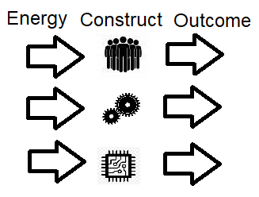

*Community actualization is more important than self actualization.*

In this section I want to describe the journey. It’s been very similar to climbing a mountain. Imagine for instance a person physically untrained sets the goal of taking a difficult journey to the top of a mountain. They have a strong sense of purpose and as they struggle they will grow. This process takes time. I’m writing the following passages to encourage and support those on this journey with me. But also as a reminder to not act carelessly. Take your time and accept the journey. Great peaks won’t be achieved by the spiritually weak. My own journey started typical to most, focusing on lower areas like the physical and material. Only through a confused and gradual process of seeking did I move beyond into the realm of mental and spiritual growth.

Everything competes for its existence in our shared reality. We struggle for resources against a constantly changing backdrop of new challenges. The journey we are on, and to an even more important degree our community is on, is a journey of not only survival but of consciousness. All of the tools we use on a practical and daily basis such as our physical health, material possessions or knowledge are downstream of our spiritual consciousness. This is why the previous section was so important. But maybe equally important is understanding how to maintain and advance cutting edge God consciousness so that my community will thrive in the future.

Advancing god consciousness like anything else I have ever studied is like climbing a mountain. I was given information from my surrounding community which I can choose to maintain, build upon or let degenerate. Depending on what I choose, all things downstream of what I choose to do with that spiritual consciousness will have the same outcome eventually. There will always be change, my change should be in the upward direction. Yesterdays good is todays evil because the rules change as surely as time itself passes. There is no final destination. There is no return to tradition. This journey is forwards always. My connection to the past is only as valuable as the sound judgment I execute in finding direction from that point. That penultimate understanding is at the top.

From now on I am on that path. Everything is my responsibility. From now on I must take responsibility for everything that happens in the world. I won't be successful at accomplishing everything I set out to do. But there is no complaining because I was the person sent here to solve that problem. I am here to solve every problem. There is no one to blame anymore. Every problem in existence is a potential growth path. I now need to find the steepest path up the mountain I can handle and move that direction. I will stumble and will stop for rest. Thats ok. But at least I am able to admit to myself that these challenges are the challenge of my lifetime and my purpose in this place. I do have a special purpose. Juxtapose to that I have also realized my limitations. Big steps in my life will be small almost imperceivable changes to the whole. I have realized I can’t really be in total control like the driver of the car. But I can choose what role I will play in the events to unfold.

Because I was making these decision I fully leaned into natural theology. There were no magic books or sacred unquestionable dogmas. My actions were driven by measured results or good judgments based on those models in my mind. This is a state of living in constant spiritual revolution where your opinion on any subject can and should change daily as your learn and grow. Abandoning existing models for new and better models is underpinned by measurable outcomes.  I will make the point again and again but actions that move the community to more desired outcome are more moral.Thats why I don’t use the word moral and chose the words aligned action. The process of growing your consciousness is a decision making process. What is your vision of the future and will this decision lead to that outcome. This inherently indicates that definitions and your world view should transform or grow through this process.

There is a right from wrong and that includes other people. If you can’t identify right from wrong and who opposes your growth or is competing at your expense you will fail. You should identify the enemy of your community. How you handle that enemy is your choice. But saying it doesnt exist is denials of the truth. Have the mindset of a warrior and understand climbing this mountain will include battle. A critical component of this journey up the mountain is understanding that your community can fail. There are essentially irreversible bad outcomes that can lead to destruction. Even more importantly because of limited time and resources and the necessity of ever increasing challenges on this journey you will face competition from external forces. Your community will be in direct competition with other groups. In this realm there can be winners and losers. Likewise there were many distractions and bad paths that have been presented to me. Alternative cultures presenting a mirage of “new” ideas that were arbitrary and intentionally offering their best presentation but looking at those communities as a whole I didn’t want to immerse myself. I leaned into my struggle, careful to avoid pointless asceitism which imitates the struggle or feeling like I had arrived by participating in comfort practices that obscure my core issues.

It’s interesting to think about how cycles of growth happen in ourselves and community. We will have times of growth and failure. So will the community at large. Communities that are successful will often attract unsuccessful people who wish to parasitize that energy. Excluding those people is a critical component in yours and their growth. As communities grow people will point to unsuccessful communities as having useful solutions which might be true. But more often than not the motivation will be convenience in application masked by rationalizations.

When people grow up they often go through a few stages. When they're children adults seem invincible and knowldegeable, then during the teenage years we question the constraints of authority while not really appreciating the benefits of that wisdom and then finally, hopefully, we enter a more adult phase were we provide the basis of learning and support and constraints to help those below us. People often go through a similar process in regards to institutions of human design as well as God consciousness itself. We go through the stages of God is a father figure in the sky similar to sants claus, or that the government is a just organization that represents your interests. Then the teenage years where we embrace ideas like libertarianism or atheism because we only see the constraints and faults in the system. We frequently only believe what we can measure in simple terms and see everything as dead clockwork. Then finally we move into a position of adulthood where we take responsibility for the systems or accept the consciousness and input of other including beings greater than ourselves like God. I believe there are stages like this within the meta-conscioussness. Where communities believe naively and achieve great things at a leap of faith, then they may have periods of disillusionment where there are failures, only to then settle into wiser long term views that come with past knowledge.  These similiar patterns are all happening concurrently at multiple levels much like fractals. The longest term view can be examined through old ideas transforming. God is less and less viewed anthropomorphically as a person in the sky and more and more as an abstract example of reason with the sky reflecting a difficult state to exist within. Concepts like prayer more reflect the process of reasoning. Right now we are exiting the teenage years where we think we perceive existance with the depth of an adult but from the naive perspective of a young adult. Eager to exercise our newly found strength, but in total disregard for the quiet observation of consciousness much greater than our own.

I’ve talked about the journey up the mountain in sort of an academic way up until this point. Now I want to talk about the real world which is much grittier and full of participants who have opposing goals and are competing for position against you at your expense. I call this subject spiritual technology.

Mechanical technology is constructing a machine, then inputting energy to get a desired outcome. This would be something like a car for example. It’s more efficient for us to harness gasoline energy than to walk. Information technology is constructing computation devices such as a computer and inputting energy from a power cord to gain new information. It’s much easier to use an excel sheet than manage your accounting on paper. Finally spiritual technology is constructing a world view in the minds of other people who become invested in that worldview then revealing challenges to that world view. When the people within the spiritual technology framework have an emotional response to the perceived situation they act out the desired outcome of the person who manipulates them through spiritual technology. It’s important to understand that if the reader reacts negatively to ideas in this book it’s not because I have spent years crafting you into my spiritual machinery. Rather it might be the opposite, maybe you are a piece in someone else's spiritual machine and I’m just releasing you from that spell.

I used the word spell very intentionally, think about what a spell is. Its magic words. Magic words that can get you to do things. Frequently this is done with focus groups paid for by people with interests in affecting your behavior. The commonly coined phrase is “problem, reaction solution”. By making you feel you need a product they harness you in the machine when you buy that product. By making your feel like some other person is your political enemy they get you to support the opposition of your perceived enemy.

Lastly please understand that as your ascent up the mountain will be limited by your patience. Your patience in learning new things and your patience when dealing with others. As you grow and leave other behind you will struggle at times to deal with the gap in understanding between yourself and them. Encourage them but don’t coddle them. Be willing to listen and learn.