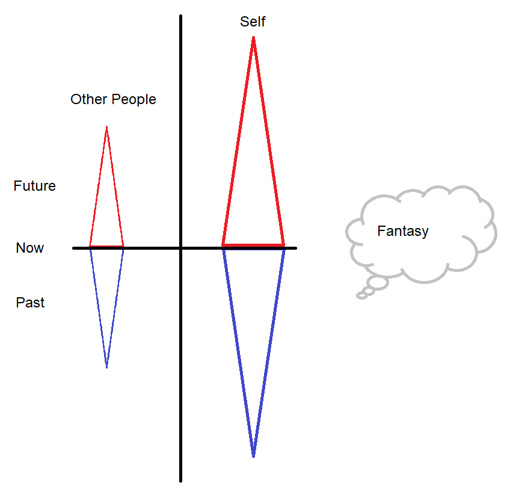
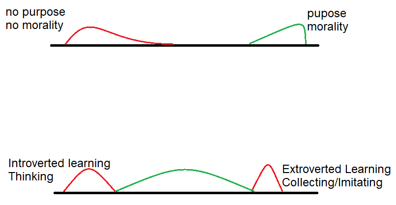

*Accepet truth, seek growth*

If the revelations section represents a goal or fundamental purpose in an abstract way. The mountain section describes the journey. This section would represent the tools of skills needed to make that journey. This section is about thinking patterns for real life situations that will bring your view into alignment with reality.

Making judgments and decisions is the core framework below. These decisions sort and categorize the information from the world around us into a mental model about how the world works. When making decisions were attempting to define a goal, then make a prediction about the series of outcomes that will result from the decision(s). The revelation sections is my fundamental purpose and abstract thoughts on consciousness. This section is a translation of of those abstract ideas into thinking patterns for real life situations.

1. Take Responsibility - In order to avoid a possible anachronism im starting with the macro or driving force behind how my thinking came to take place. My earliest memory was noticing how people say “they say…” or “they should…” when reporting some alleged fact or some grand improvement that could be made to society. Who is they? Instead maybe I should be asking, What do I say? What will I do? However when I started changing I didn’t really understand the full consequences of it. I was going through a revolution of the spirit, mind and body. One of my early key changes was taking responsibility. No more was I going to be dependent on someone else knowing how things worked or passing the blame for how things were turning out. I took this to the most extreme degree I could imagine and said I would take responsibility for anything and everything thats happening in the world on a spiritual level. I used to say thing at the time like “If someone trips and falls 10000 miles away why hadn’t I solved that problem?” Living in this type of psychology rapidly changes how you can mentally react to problems. Your growth is limited by your challenges. Unlimited responsibility provides unlimited challenges leading to potentially unlimited growth.
2. TTake Action Now - The second part of this is doing the right thing in growing the consciousness of myself or the community. When faced with a choice I started asking myself what I thought the best decision was with that factor in mind. Being invested in a community win isn’t about pointlessly sacrificing yourself or giving other peoples opinion value beyond the time the other person has invested in forming them. But it does include showing how the outcomes i chose are in our best interests. The best way to implement these strategies is to imagine an idealized person who represents a person you want to be. At first you might imagine someone whos smart and hard working. But tomorrow when you leave the house in sweatpants stained with last night dinner, or before you sit down to several hours of mind numbing video media you might ask yourself if this is what the idealized person would do. Small decisions can lead to big consequences. Then again ask what the idealized community would look like? Is that ideal based off of a TV show or is it a realistic long term workable strategy based off of evidence.

What Actions TO Take -
I want to share how I analyze myself and other people. Firstly here is how I currently view where people live in their minds.

There are two columns with left one being external focus on others and the right being internal focus on the self. Each of those is broken into the present, the past and the future. Lastly there is the fantasy cloud which is internal and where creativity and desire exist for how the world could be, but not how it is. The triangles narrow into the past and future as it's harder to make that jump mentally and it would probably bend into the fantasy thought cloud as the triangle narrows and memories or predictions become closer to fantasy. The external is smaller because I think its harder to understand what others are going through.

My thoughts throughout the day exist as a single point on this map. That point is constantly moving around and at the end of a day would have so many dots the diagram would look kind of like a cloud. I wonder what peoples cloud would look like on this diagram. I think there are empath type people who are so externally focused they cant help but be driven by other people within their interaction. I think there are present/slightly future people who just go with the flow in a responsible way. I also think there are internal fantasy people who watch lots of TV or live in a sort of constructed reality and kind of go through life in their own heads. I think about this to balance myself because each of these regions has an advantage and disadvantage. No region should be ignored or dwelled upon.

I will talk more about the basic idea of how I make these comparisons soon. But these are my tools for self reflection and gaining understanding about others. I want to share more of them and I think you will be familiar with some of them as well. They basically involve holding two ideas as separate and different then deciding if they are either good, bad or maybe good in some situations but not others. I often not only measure others but also self reflect and try to understand when I should be adopting either strategy.

The biggest is morality and amorality or what I usually call aligned or unaligned action. That is the idea that a decisions and judgments should be made about the world. Amorality or unaligned action is leaning into a sort of meaningless world view where consequences aren’t discernable because maybe there aren’t any goals in the first place. Aligned action is being able to examine different scenarios and deciding that certain outcomes are better based on your purpose and goals. I think currently people view morality as a pointless exercise because they aren’t building towards anything and therefore cant measure any useful outcome, but rather were handed a hollowed out world view with a dogmatic and legalistic guilt ritual which isn’t really the point of morality at all. In my opinion you can always lean into morality and judgment as a concept if you have spirituality.

Juxtapose that with internal learning vs extraverted learning which I think should be balanced. People learn in a bayesian way in that repeated encounters with an ideas slowly shaping their world view. People with high external learning absorb lots of information and details but will struggle with reasoning about those details. People with strong internal learning will focus and prioritize external cues based on internal reasoning. I think the unhealthy external is a childlike world view in which you absorb everything you see and for example its hard to distinguish TV from reality. I think an unhealthy internal learner is someone who would become an expert in some niche ideas but miss huge swaths of other information. A healthy balance is to live at both extremes, that is, to be able to absorb lots of information on new types of information and to also process that information into something useful.

The image below where each decision I could make would fall with red bad and green good. Both of the represent personality vectorizations with distributions

There are lots of ways I could vectorize a person. Healthy lifetsyle vs unhealthy, inrovtered vs extroverted, creative vs systematic, thoughtful vs careless. The list could be very long but rather than go through them all I just want to document here that they exist and that I consider them something useful to think about. But I really want to focus in and describe my thoughts on the collecting of information and then reasoning about it. Because that ability to learn and grow has been a huge factor in driving those other personality vectors through the process of external learning which is collecting information and internal learning which is processing that information.

On my journey an important part has been my willingness to change, followed by self reflection and then trying to balance these different characteristics. Do I make logical or emotional contracts with the world around me? Do I avoid pain or seek pleasure? Can I be patient and sometimes wrong? Can I take incremental steps and lean into an idea instead of saying something must be done? Can I truly say I understand the other persons point of view or do I throw my hands up and say” I just don’t get how they think this way”

The best teachers in life are often other people, whether they intend to be or not. That’s why I try to remain patient with their journey, learning from both their successes and mistakes. In challenging times, I’ve found that engaging in arguments is often unproductive. Instead, I listen, ask sincere questions, and when a conversation reaches logical inconsistencies, I leave it there—thanking them for sharing and offering words of encouragement.

One of the most common barriers to independent thinking is what I call the "no decision, decision"—a form of passivity where people avoid making choices by either dismissing their importance or allowing others to define them. This psychological pattern is often reinforced by outside influences that downplay critical decisions, redefine them in simplistic terms, or discourage questioning altogether.

We see this in many areas of life. For example, when a company markets a product as simply "safe," that statement may not align with an individual's personal standards of safety. Sometimes, short-term economic interests drive narratives that discourage deeper scrutiny, as we've seen with certain medications or food products. But do potentially harmful products really deserve a place in our daily lives? Shouldn't we have the freedom to question and make informed choices?

A similar pattern emerges in discussions about culture and identity. Simplistic statements like "race is just skin color" or "all cultures are equal in every way" may sound unifying, but they can also reduce the complexity of human experience to falseified abstract ideals rather than lived realities. Throughout history, societies have faced challenges when different groups were rapidly merged without careful consideration of long-term consequences—whether in colonial-era India or modern migrations into Europe and the United States. Rather than dismissing these concerns outright, we should be willing to engage in honest discussions about how societies function best.

When people in my community discourage discussion on these topics, they aren’t truly preventing a decision from taking place. What they’re actually doing is surrendering the power of choice to external forces. Over time, communities can be led through a gradual process where a bad decision first becomes "unimportant," then "inevitable," and finally "good"—even if its original consequences were harmful. To maintain control over our future, we must be able to openly explore ideas, ask difficult questions, and recognize that having a choice is the foundation of a communities self-determination.

**External Learning/Sampling**

External learning is also the more intuitive learning process. For example children start imitating people in their lives without the ability to analyze why the behavior is important. As people grow into adults external learning is collecting experiences through interactions in our life. It’s the taking in of information from a book read or a show watched. My journey to collect information has been critically important and I want to share a bit about that. In the framework section I presented some initial thoughts on sampling errors. Sampling errors are errors a person can make that would have been avoided if they had more information or “samples”.There is an experiment were chimpanzees and toddlers are both given the task to stand up a purposely lopsided wood block. The chimpanzee gets angry when the block wont stand. The toddler turns over the block to inspect it. That willingness to question and investigate is the difference.

One of the greatest strategies in collecting more information has been to reduce the amount of time I spend on pointless activities. I have in the last few years become a big advocate in reducing the time spent working for financial gain so that I can focus my time growing as a person by looking into new things. Now only working but sports or social media can be huge time wastes that I avoid. I have read other people talk about this and I think it’s such a critical point I'm bringing it up first. So focusing my mental energy into new things that will help me grow and learn has been crucial.

Another important concept for me was knowing that my opinion was going to change everyday and actively looking for ways to change it. One of the big risks I’ve noticed is people who try and put things in a box and finalize their knowledge. I don’t believe in that. I may grow bored of a certain subject and stop researching it but its not because I have “mastered it”. Rather I have more interesting or important growth that needs to happen elsewhere so I take a break.

I also think it’s really important to see people for their value because people have such powerful minds. It’s like having a computer study something and condense that lifetime of study down into actionable cues. So I try to observe them as they observe something else in order to understand what they are looking for. I also try and ask them questions and let them share their experiences. If it’s interactions that Im not experienced in I just go for the big picture and accept that i can refine and iterate later.I think different opinions are so valuable for the perspective but ill explain later how dangerous they can be without the followup up of rationalizing those inputs.

One of the biggest follies I see is disconnected cause and effect and low information decisions. For example most people know they are bad at fixing a car because the feedback loop is as quick as turning the key and seeing it doesn’t start. But on the other hand still think they know how the economy or spirituality works when the feedback loop for that is insanely complex. They simply don’t gather information and like someone with leprosy dissolve their community into nubs with their careless and insensitive actions.

Lastly on the subject of information collecting I want to refine it a bit more and say not only do I avoid time waste activities but I also question the quality of supposed useful information collecting. One of the pitfalls I have observed is the canonization of knowledge as complete, or to create a certificate system for the purpose of quickly sharing a persons skill level. I’ve noticed these are risky because they inherently attract and may encourage the creation of heavily extraverted learners who imitate the canons without any real understanding. Eventually rising into the organization to create a directionless leadership. I also think when you search for information its important to ask if you want that persons results, or if they have learned their own lessons and the information is truly useful. Imagine someone who has been insulated by an age old system with little personal experience who is using turn of phrase they don’t really understand. Even if their intention to help you is sincere it may not be worth it to invest much time into what they can offer.

**Internal Learning/Reasoning**

The previous section in itself is a series of thought tools about collecting information that took internal reasoning to develop. Now I want to share some of those internal reasoning tools as they are critical in maintaining and building yourself and the community further. The weakness of a person balanced towards internal learning will be lack of empathy or memorization for use in fast paced situations like medical trauma response. Too much internal learning can create a reclusive introvert who might be good at math. A healthy amount of internal learning will allow a person or community to digest external cues and weight them appropriately.

Internal learning and reasoning has a great phrase I like to use called a “thought experiment”. Your ability to perform thought experiments and imagine future scenarios will affect your ability to make conscious decisions. Imagine you walking around downtown and someone drops a brick onto your head. You can pretty easily imagine what would happen. Or for example, would twelve 25 dollar checks be worth more than $275? Thats a bit harder. The second example demonsrates that as  thought experiments become more complex you enter the world of math. In this document I will focus on qualitative thinking tools but I enjoy venturing into math as a subject also. Math is typically taught in an extroverted learning style so people often can’t really use it to solve real life problems. But eventually internal learning tools will lead to math.

One of the thought tools we all use is vectorizing. Comparing two different concepts such as hot and cold which I did at the beginning. Later on I talked about breaking down personality into a collection of vectorizations such as extroverted and introverted. If you want to understand something better try vectorizing it to make comparisons. We take the meaning of lots of words for granted but often diving into the etymology and then attempting to vectorize them in a very casual way can yield interesting results. Take the word scientist. What is a scientist? The etymology of the word is to “know”. When people think naive of what a scientist is they think of vectorizations such as smart (vs dumb), well researched (vs low information), hard working (vs lazy) and truthful (vs deceptive) in comparison to the broader community. However people incorrectly and post hoc try and label a scientist as someone with a degree, or someone who collect data or someone who uses “the scientific method”.

Another great thinking tool is exaggerating the outcomes to get a clearer picture. In this way you can locate a threshold with which you are able to rationalize about a subject. Ask yourself what evidence it would take to change your opinion on a subject. If evidence and reason can’t get you there then it will be difficult for evidence and reason to move you away. People use exxagrative reasoning with the thought “how would you like it if that was done to you?”.Where the outcome is exaggerated to affect the person reasoning about it more. Drinking water is healthy but too much and you will drown. What would happen if the cost of a non-biodegradable product approached zero?  These are very simplistic examples but it can really help you reason about consequences that people will tell you are small or non-existant but are actually very significant.

Briefly I want to touch on how thought experiments happen because its almost an intuitive process that most people don’t build onto. But as you go through life you will build a model about how you think the world works. That model is how you perform your thought experiments. I have often noticed that people use a defined strategy to achieve a result which I call the SmmS view short for System -model-model System. The first system is external reality. The first model is the mental model of how that system works. The second model is the change you desire to implement and the final system is the routine or plan of action you put into place to achieve that goal.

I talked about in a previous section how as your ability to sample changes so will the results. In the real world there is no smooth straight line or constant value. Things happen in cycles both big and small. Knowing that and being able to find your role within that cycle are two very different things. When we begin to notice the cycles, fractals and balance thats occurring its tempting to find meaning where there isn’t. Apply anything you learn holistically by focusing on things that can create measurable outcomes. Spending time studying math, eating healthy, being frugal or being a good friend have measurable outcomes. Finding balance is important and spending lots of time doing thought experiments in isolation or hanging out with friend and drawing geometric shapes are bad thought patterns. Use these tools to change. Not stay the same.

Backwards rationalization is an undesirable pattern that allows bad motivates to be masked as rational motives. This might include action faking which is when you have something you need to do you find something thats less work but is still objectively good and work on that instead.  Look at the motive and look out for antipatterns like these.  Another bad thought pattern is the search for novelty for novelties sake which is the desire for something new that isn’t objectively better than the old thing. It may often be worse. The return to tradition or the past is convenient thought pattern for example. These though patterns offer dated solutions that lead to the current situation and are a fantasy that ignores the current struggle with anachronism of living in easier circumstances with todays information.  These thought patterns lead to conclusions that avoid self examination and use the rational mind against itself.

The mental fatigue thought experiment is designed to simplify your processes. It’s one of the great unknown supports of civilization from an economic standpoint. When trying to solve a new problem there is enormous mental effort placed into solving it. Some time later it becomes a highly repeatable and easy process because the steps to reproduce the result have been simplified. When looking at systems in your life such as the workplace, home  or community you will frequently notice there are repetitive thinking tasks. Always be asking how you can reduce mental fatigue for the person who comes after you. Always be asking how you can reduce your workload by simplifying your life. Investigation fatigue and decision fatigue should be reserved for important investigations and decisions. It's important to exercise your mind in a planned, useful and productive way, not to be used up doing busy work.

A great tool is shifting your perspective in a very intentional way.First get some perspective on yourself. I frequently used to say things like “They say…” or “I don’t get how people can think that way”. Who was they? Also, yes I was right in that I didn’t understand the other persons point of view and I wasn’t willing to learn at the time. Now I say “ I understand why you believe that, here is how my view is different”. On that point, try spending time imagining what someone else would think about a certain situation and why they would think that way. If you invest lots of time and energy into this you might be surprised at the results. If you don’t understand their actions you likely don’t really understand them as a person. This will also help you learn what questions to ask people. Another way to look at perspective shifting is to break down big problem into manageable chunks and solve them one at a time. Or opposite of that to stand back and take in a macro perspective and see if the direction is still moving towards your target goal.

Lastly, there are lots of these that were put together as times in my life when my purpose was very murky. But now I think having the broad framework of community consciousness and aligning decisions within those goals gives the learning and thinking tools here teeth because now they will have a useful direction that when applied daily and repeatedly will lead to those long term outcomes.